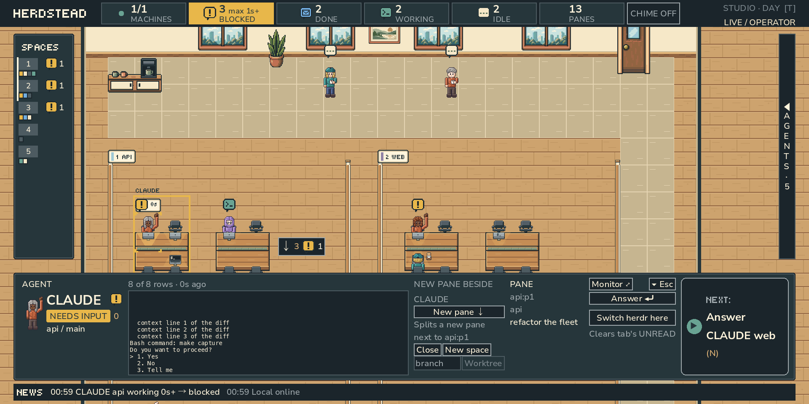
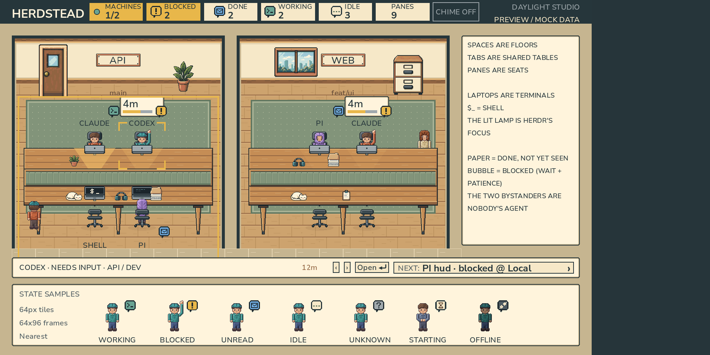

# Herdstead

**A pixel home for your coding agents.**

Herdstead is a [Godot](https://godotengine.org) 4.7 app that draws a [herdr](https://herdr.dev) session as a pixel
open-plan office. Each herdr machine is one office map, each workspace a zone of it, each tab a pod of desks, each pane a seat, and each
coding agent the person sitting in it. Blocked agents raise their hands, finished ones leave a stack of paper on the desk,
idle ones walk over to the pantry. You can see who needs you at a glance, and answer them from the office.



## Requirements

- **Godot 4.7** (verified with 4.7.2). The socket client uses `StreamPeerUDS`, which needs Godot 4.6 or later.
- **herdr** running locally, and for remote machines, passwordless SSH to each machine herdr has saved.
- **macOS or Linux** (herdr's socket is a Unix socket). A packaged macOS app is described in the
  [manual](docs/MANUAL.md#download-and-run-the-macos-app).
- Python 3.11+ with Pillow only if you rebuild the art (`make setup`).

The runtime PNGs and editor resources are committed, so no build step is needed to run it.

## Quick start

From a clone of this repository:

```sh
make run                                                  # or: godot --path .
godot --path . -- --socket=/absolute/path/herdr.sock      # a specific herdr session
godot --path . -- --read-only                             # watch only: never writes to herdr
```

Socket path, first match wins: `--socket=` > `HERDR_SOCKET_PATH` > `~/.config/herdr/herdr.sock`. You can also open
`project.godot` in the Godot editor and press F5. `godot --path . scenes/preview.tscn` opens a mock showroom that never
connects to herdr.

## What it can do

- **The office**: one floor at a time, with a stable grid layout that never reshuffles your tables. People walk in from the
  lift when an agent starts and walk out when it goes. Disconnected machines dim and freeze; offline is never shown as idle.
- **Top bar counters** in herdr's words (`MACHINES`, `BLOCKED 2 max 12m`, `DONE`, `WORKING`, `IDLE`, `PANES`); click to
  jump to whoever waited longest or filter the list.
- **SPACES rail** on the left: every machine's spaces, worktree mezzanines after their source, a mark on the ones in
  view; and arrows on the edges of the world pointing to blocked agents out of view.
- **Agent list** drawer (`A`), flat by urgency or as a tree, plus an **EVENTS** tab and a **NEWS** line of state changes
  observed this session.
- **Staff panel** at the bottom with a live terminal preview, **NEXT** (`N`: the next agent that needs you), and
  **Switch herdr here**.
- **Answer mode**: answer a blocked agent with `1`–`9` / `y` / `n` / Enter / Esc, or send an idle one a line.
- **Start agent**, **New pane**, **Close**, **New space** and **Worktree** from the staff panel, by mouse click only.
- **Terminal monitor** (`M`): a full-screen pixel view of a pane's screen with live keyboard pass-through.
- **OVERVIEW** (`O`): one row per pane with timelines. **Lens** (hold `L`): how long everyone has been in their state.
  **Strategic view** (`S`): a diagram of the whole map.
- **Background alerts**: `(N)` in the window title, a Dock bounce, and an optional chime.
- **Day and night**: one pack, Studio, lit by the local clock: by night the office is darker and cooler, the desk lamps burn harder and the windows show the city at night; `T` turns the light over for a while.
- **Several machines**: every SSH machine herdr has saved becomes its own map, reached over `ssh -L`.



The [manual](docs/MANUAL.md) covers every screen, key and option.

## Safety model

Herdstead is an **operator by default**, and every write goes through one boundary.

- The read path sends only `ping`, `session.snapshot` and `events.subscribe`.
- Every other request is sent only by `scripts/herdr_commands.gd` (`HerdrCommands`), from a fixed allowlist of methods,
  and only in response to a gesture you make: a click on the staff panel, a key in answer mode, a key in the terminal
  monitor. Refreshes, timers, state changes and the event stream never write. Writes are single-flight, are checked
  again against the screen before they go out, and are never retried; a lost reply is shown as an unknown result.
- **`--read-only` never constructs the boundary.** The office then sends only the three read requests, shows no write
  buttons, and the terminal monitor neither reads nor sends.
- Remote input (snapshots, machine lists, terminal text) is validated and bounded before anything draws it.

The full rules are in [docs/WRITE_BOUNDARY.md](docs/WRITE_BOUNDARY.md). When you run, screenshot or measure next to
someone else's herdr session, point `--socket=` at a fake herdr or add `--read-only`.

## Development

Every command lives in the `Makefile`; `make help` lists them.

```sh
make setup      # .venv with the Python and lint tools
make import     # fill Godot's import cache after a fresh clone
make check      # everything CI runs: script load, packs, lint, docs, art tests, all Godot tests
make test       # only the Godot and Python tests
make fmt        # format GDScript the way make lint expects
make capture OUT=/abs/dir   # screenshots against a fake herdr (needs a display)
```

Tests and CI never connect to a real herdr; they use `tools/fake_herdr.py` and `tools/fake_ssh.py`. The rules for
changing the code (invariants, what to keep in sync, how to test) are in [AGENTS.md](AGENTS.md).

## Documentation

| Document | What it covers |
|---|---|
| [docs/MANUAL.md](docs/MANUAL.md) | The full user manual: every feature, key, option, theme tooling, export and CI |
| [docs/WRITE_BOUNDARY.md](docs/WRITE_BOUNDARY.md) | What Herdstead may send to herdr, when, and how each write is checked |
| [docs/VISUAL_LANGUAGE.md](docs/VISUAL_LANGUAGE.md) | What every thing on screen stands for in herdr |
| [docs/WORLD_MODEL.md](docs/WORLD_MODEL.md) | Depth, collision, pod geometry, stable maps and walking |
| [docs/ASSET_SPEC.md](docs/ASSET_SPEC.md) | Art pack format: sizes, pivots, density, palettes, pixel people |
| [docs/ARTIST_BRIEF.md](docs/ARTIST_BRIEF.md) | A brief for pixel artists who do not write code |
| [docs/MACHINES.md](docs/MACHINES.md) | herdr machines over SSH: forwarding, cleanup, validation |
| [AGENTS.md](AGENTS.md) | Contributor rules, for people and AI agents |

## Licence

Code and art (tiles, furniture, characters, UI icons, theme palettes) are released under the [MIT licence](LICENSE).
The bundled Nunito Sans and Tiny5 fonts are under their own SIL Open Font License 1.1; their `*OFL.txt` files ship next to
them in each pack's `fonts/` directory and must travel with them. Third-party agent logos, used only in the Avatar
Studio, keep their own terms; sources are listed in `assets/agent_badges/ATTRIBUTIONS.md`.
